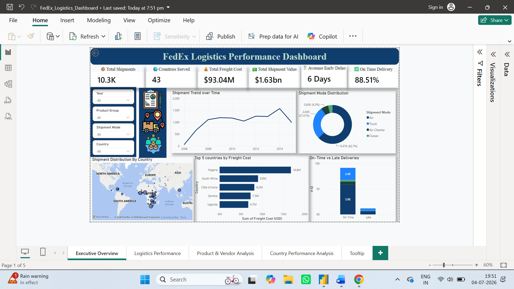
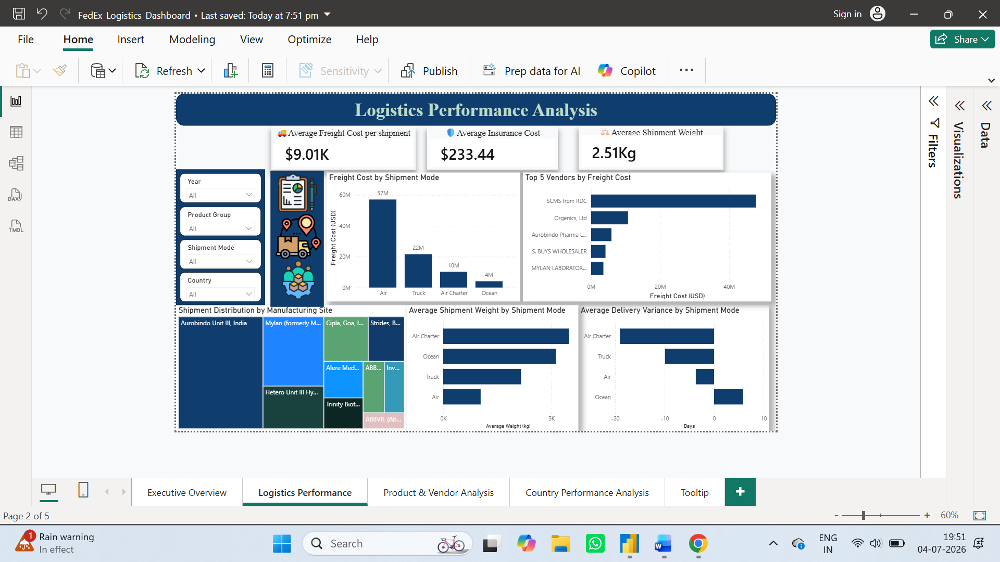
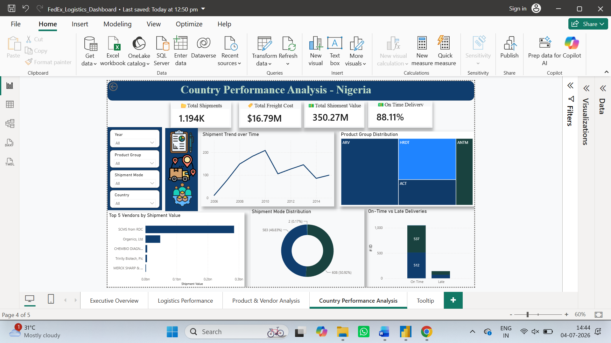

# FedEx Logistics Performance Dashboard

## Project Overview

This project is an interactive Power BI dashboard developed using the SCMS Delivery History dataset to analyze logistics operations, shipment performance, freight costs, vendor efficiency, product analysis, and country-wise logistics performance.

## Dashboard Features

- Executive Overview
- Logistics Performance Analysis
- Product & Vendor Analysis
- Country Performance Analysis
- Drill-through
- Custom Tooltip
- Dynamic Page Titles
- Interactive Filters
- DAX Measures
- Calendar Table

## Tools Used

- Microsoft Power BI
- Power Query
- DAX
- Microsoft Excel
- GitHub

## Dataset

SCMS Delivery History Dataset

Total Records: 10,324

Countries Covered: 43

## Files Included

- FedEx_Logistics_Dashboard.pbix
- SCMS_Cleaned.csv
- Dashboard Report
- Dashboard Screenshots

# Dashboard Preview

## Executive Overview

## Logistics Performance Analysis

## Product & Vendor Analysis

## Country Performance Analysis

## Custom Tooltip

## Note

The dashboard is provided as a `.pbix` file and can be opened directly using Microsoft Power BI Desktop.
